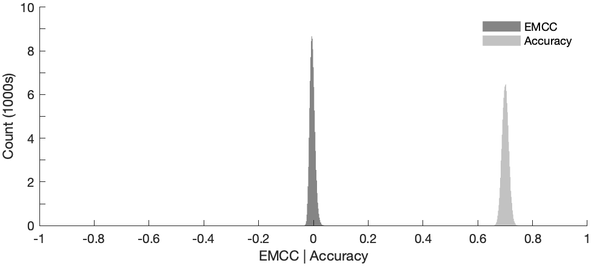

[](https://au.mathworks.com/matlabcentral/fileexchange/180711-a-matlab-implementation-of-matthews-correlation-coefficient#add-tags-span)

# extended-mcc

A Matlab implementation of the extended (multiclass) Matthews correlation coefficient (EMCC).
The extended Matthews correlation coefficient is described in:

  Stoica P, Babu P. (2024) Pearson–Matthews correlation coefficients for binary and multinary classification. Signal Proc. 222:109511. doi: 10.1016/j.sigpro.2024.109511.

The Matthews correlation coefficient (MCC) is often considered one of the most useful metrics for assessing performance of a binary classification. This is because the MCC is often more informative than common alternatives such as accuracy or F1-score, especially when classes have significantly different sizes. The extended MCC is an extension of the MCC for k>=2 classes. For k=2 (i.e., binary classification), EMCC reduces to MCC.

Example usage:
```
k = 4; % four classes

nsamp = 1e3;
nrepl = 1e5;

accuracy = NaN(nrepl,1);
mcc = NaN(nrepl,1);

% generate imbalanced confusion matricies
for ii = 1:nrepl
  y = randi(k,0.2*nsamp,1);
  yhat = randi(k,0.2*nsamp,1); % random class pedictions

  cm = confusionmat(yhat,y);
  cm(1,1) = cm(1,1)+0.8*nsamp; % imbalanced

  mcc(ii) = emcc(cm);
  accuracy(ii) = 2*sum(diag(cm))./sum(cm(:)) - 1; % note [-1,1] for comparison with mcc
end

% plot distributions of mcc and accuracy
figure;

edges = linspace(-1,1,1e3);
histogram(mcc,'BinEdges',edges,'EdgeColor','none','FaceColor',0.2*ones(1,3)); hold on
histogram(accuracy,'BinEdges',edges,'EdgeColor','none','FaceColor',0.6*ones(1,3));

box off;
legend({'EMCC','Accuracy'},'box','off');

xlabel('EMCC | Accuracy');
ylabel('Count');
```

The example above generates `nrepl` confusion matricies for four imbalanced classes and plots distributions of extended MCC and accuracy (shown below). Values of extended MCC are distributed around 0, consistent with random class predictions. Accuracy tends to provide an optimistic measure of performance.



For a discussion of Matthews correlation coefficient in binary classification, see:

  Chicco D, Jurman G. (2020) The advantages of the Matthews correlation coefficient (MCC) over F1 score and accuracy in binary classification evaluation. BMC Genomics 21:6. doi: 10.1186/s12864-019-6413-7.